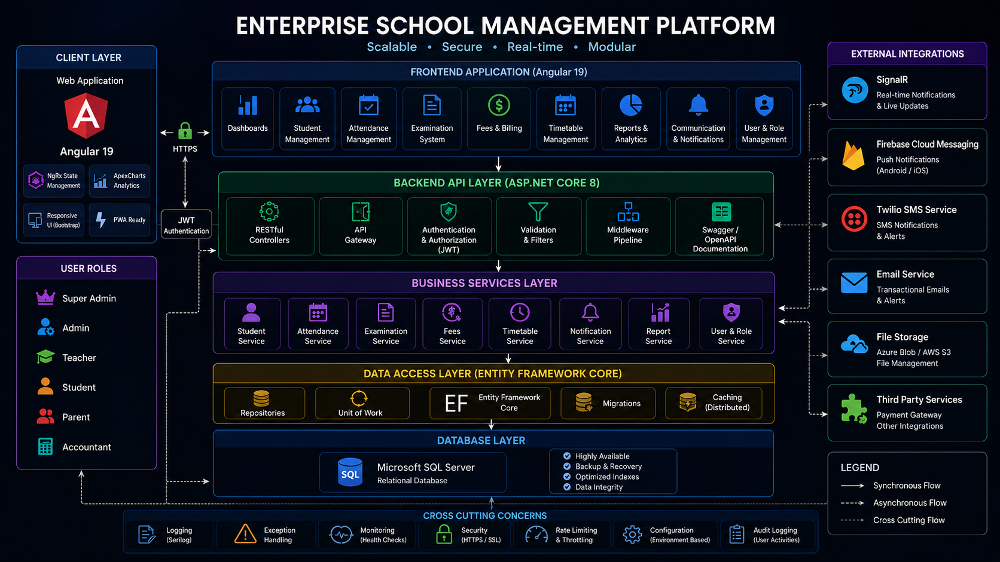
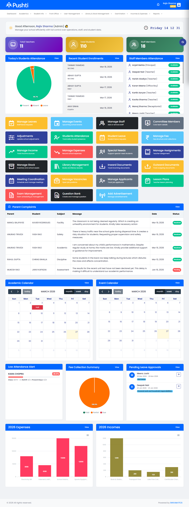
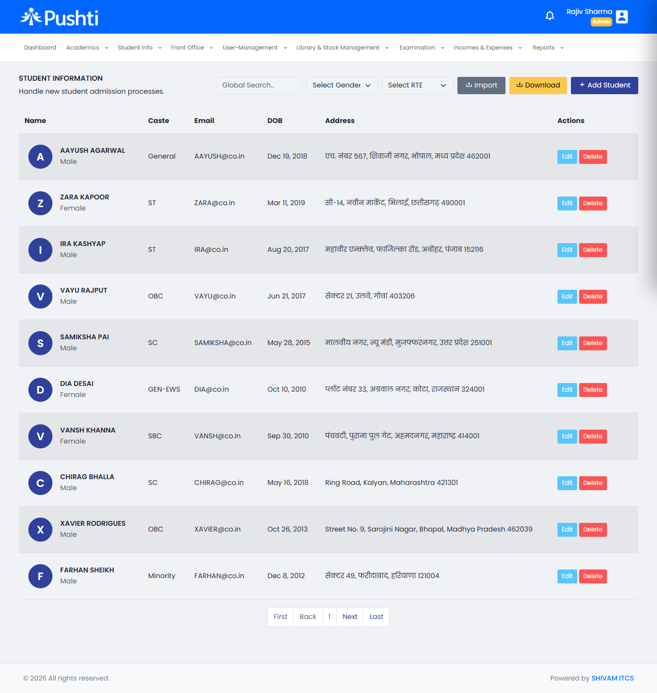
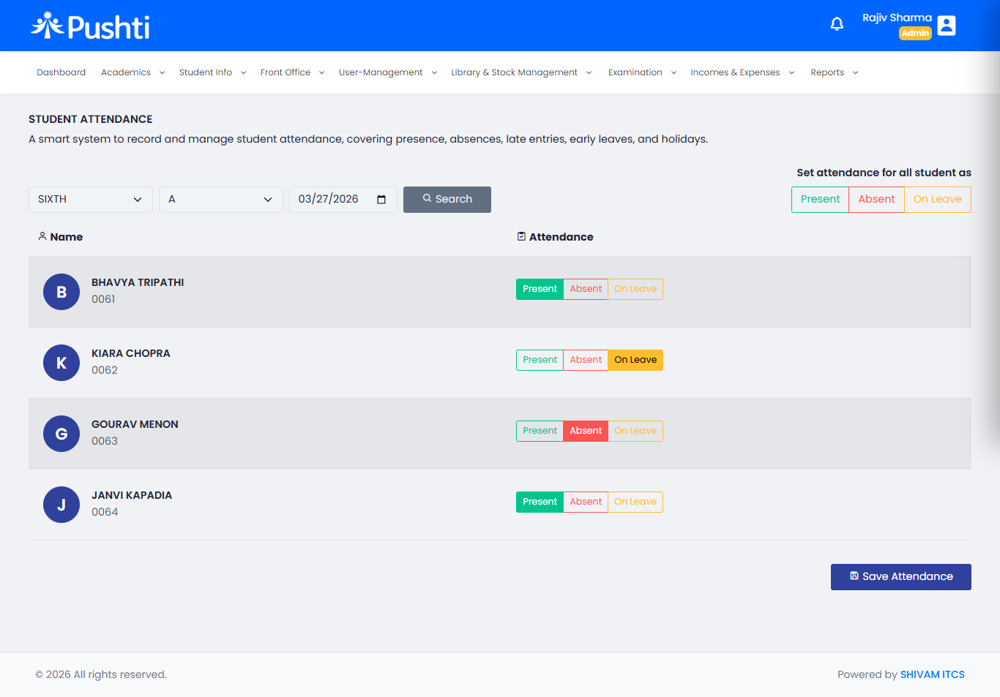
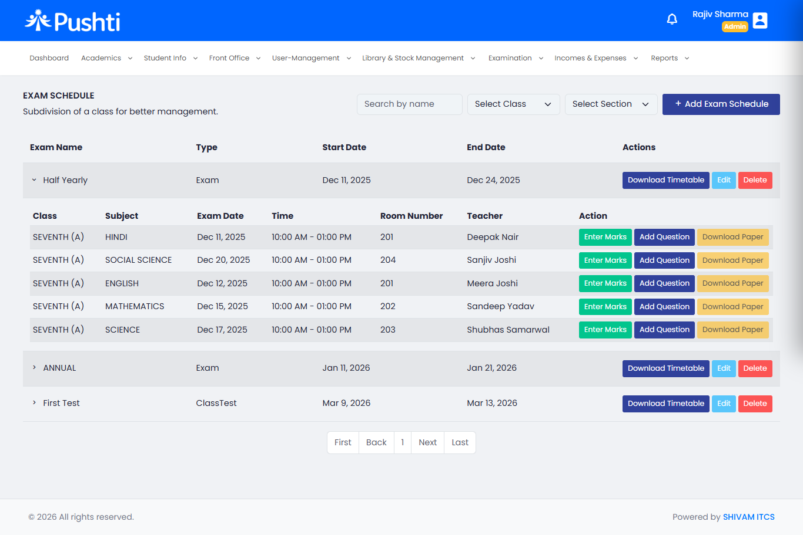
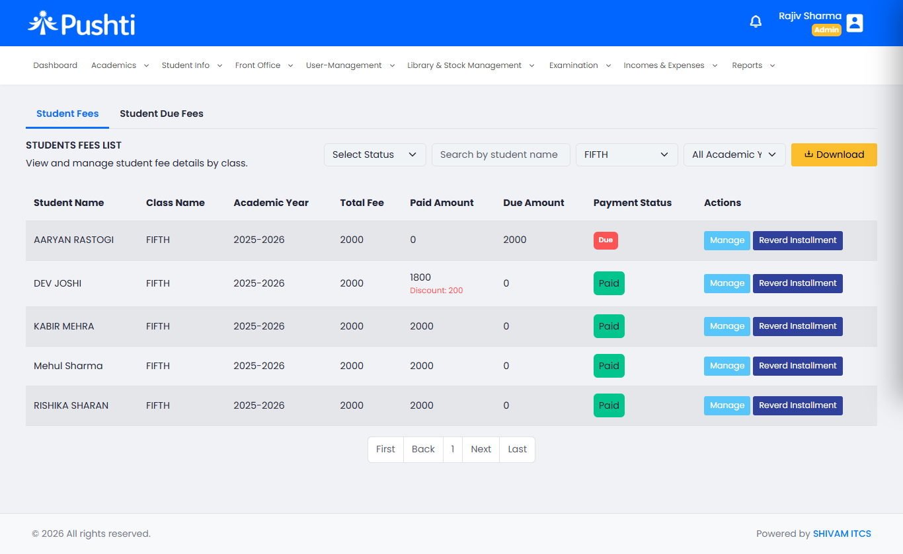
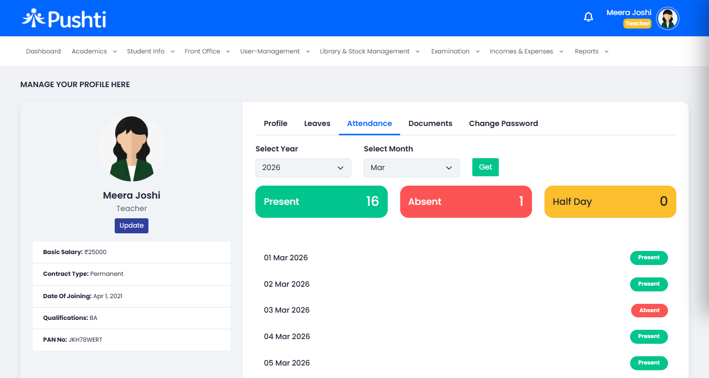
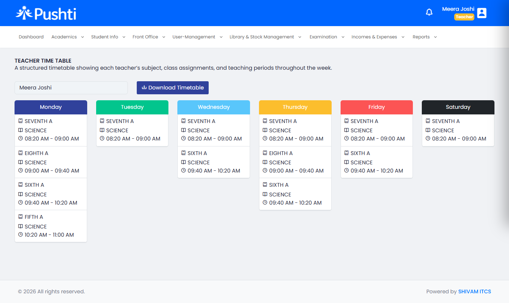
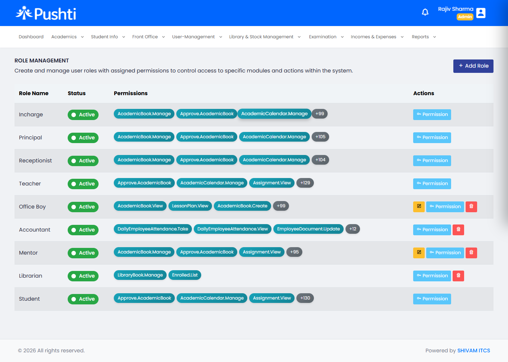

# School Management System


Modern enterprise-grade school management system built with Angular 19 and ASP.NET Core 8, designed for scalable academic operations, analytics, communication, real-time workflows, and administrative management.

---

## Platform Highlights

- Enterprise-grade architecture
- Real-time notifications with SignalR
- JWT-based authentication & authorization
- Firebase cloud messaging integration
- Advanced analytics dashboards
- Modular Angular frontend architecture
- RESTful ASP.NET Core APIs
- Role-based access management
- Reporting & export system
- Responsive enterprise UI

---

## Core Modules

- Student Management
- Staff Management
- Attendance Tracking
- Examination System
- Fees & Billing
- Timetable Management
- Notifications & Communication
- Reports & Analytics
- Role-Based Access Control

---

## Enterprise Features

- Modular enterprise architecture
- Real-time notifications with SignalR
- Firebase push notification integration
- JWT authentication & authorization
- Responsive Angular dashboards
- RESTful API ecosystem
- PDF & Excel export support
- Optimized state management using NgRx
- Secure middleware pipeline

---

## Technology Stack

### Frontend
- Angular 19
- TypeScript
- NgRx
- Bootstrap
- ApexCharts
- Firebase

### Backend
- ASP.NET Core 8
- Entity Framework Core
- SQL Server
- SignalR
- JWT Authentication
- Swagger

---

## Platform Overview

The Enterprise School Management system is designed to centralize academic operations, administration, communication workflows, analytics, and reporting into a unified scalable ecosystem.

The system enables educational institutions to manage students, staff, attendance, examinations, notifications, and operational workflows through a modern role-based platform with real-time communication capabilities.

## System Architecture

The platform follows a scalable enterprise-grade architecture designed for academic operations, real-time communication, analytics, and secure workflow management.

<p align="center">
  
</p>

---

### Architecture Highlights

- Modular enterprise architecture
- Angular 19 frontend ecosystem
- ASP.NET Core 8 REST APIs
- JWT authentication & authorization
- SignalR real-time communication
- SQL Server relational database
- Firebase cloud messaging integration
- Role-based access management
- Scalable service-oriented workflows
- Analytics & reporting infrastructure

---

### Core Architecture Layers

| Layer | Responsibility |
|-------|----------------|
| Frontend Layer | Angular dashboards, UI workflows, analytics |
| API Layer | REST APIs, authentication, middleware |
| Business Layer | Academic workflows & operational services |
| Data Access Layer | Entity Framework Core & repositories |
| Database Layer | SQL Server relational storage |
| Integrations | SignalR, Firebase, Email, SMS services |

---

### Enterprise Capabilities

- Real-time notifications
- Secure API ecosystem
- Scalable workflow architecture
- Cross-platform communication
- Centralized academic management
- Advanced operational analytics
- Extensible enterprise modules


## Platform Preview

Modern enterprise dashboards and operational workflows designed for scalable academic management and real-time administration.

### Admin Dashboard

<p align="center">
  
</p>

---

### Student Management

<p align="center">
  
</p>

---

### Attendance Management

<p align="center">
  
</p>

---

### Examination & Academic Operations

<p align="center">
  
</p>

---

### Fees & Billing Management

<p align="center">
  
</p>

---

### Reports & Analytics

<p align="center">
  
</p>

---

### Timetable Management

<p align="center">
  
</p>

---

### Role & User Management

<p align="center">
  
</p>

## Business Case Study

### Problem Statement

Educational institutions often struggle with fragmented systems for attendance tracking, academic management, communication workflows, reporting, and administrative operations.

Traditional workflows lead to:
- delayed communication
- disconnected academic records
- inefficient reporting
- manual operational overhead
- limited real-time visibility

---

### Solution

The Enterprise School Management System was developed to centralize academic operations, administration, analytics, communication, and reporting into a scalable unified ecosystem.

The platform enables:
- role-based operational workflows
- real-time notifications
- centralized student & staff management
- attendance automation
- analytics dashboards
- examination & reporting systems
- secure API-driven integrations

---

### Technical Approach

Frontend:
- Angular 19
- NgRx state management
- Firebase messaging
- Responsive enterprise UI

Backend:
- ASP.NET Core 8
- Entity Framework Core
- SQL Server
- SignalR real-time communication
- JWT authentication & authorization

---

### Key Outcomes

- Improved operational efficiency
- Centralized academic workflows
- Faster communication pipelines
- Real-time notification delivery
- Scalable modular architecture
- Enhanced reporting visibility

## Platform Capabilities

### Academic Operations
- Student lifecycle management
- Attendance workflows
- Examination management
- Timetable operations
- Academic reporting

---

### Administrative Management
- Staff management
- Role-based access control
- User permissions
- Operational dashboards

---

### Communication & Notifications
- Real-time notifications
- Firebase cloud messaging
- SMS communication workflows
- Alert & announcement system

---

### Reporting & Analytics
- Dashboard analytics
- Attendance summaries
- Exportable PDF & Excel reports
- Operational insights

---

### Enterprise Engineering
- Modular architecture
- RESTful API ecosystem
- JWT authentication
- SignalR realtime workflows
- Responsive enterprise UI

## Product Roadmap

### Phase 1 — Core Platform
- Student management system
- Attendance workflows
- Examination operations
- Reporting & analytics
- Role-based access control

---

### Phase 2 — Communication Infrastructure
- Real-time notifications
- Firebase cloud messaging
- SMS integrations
- Announcement workflows

---

### Phase 3 — Enterprise Enhancements
- Advanced analytics dashboards
- Multi-school architecture
- Scalable workflow engine
- Enhanced reporting infrastructure

---

### Phase 4 — AI & Automation
- AI-powered analytics
- Intelligent attendance insights
- Automated workflow processing
- Predictive academic reporting
- AI-enabled operational dashboards

---

## Engineering Vision

The Enterprise School Management System is designed with a modern product-engineering mindset focused on scalability, operational efficiency, security, real-time workflows, and future-ready architecture.

The platform represents a modular enterprise ecosystem built to support evolving academic and administrative operations through modern frontend, backend, and communication technologies.

---

## Platform Focus Areas

- Enterprise SaaS Architecture
- Real-time Operational Workflows
- Analytics & Reporting
- Secure Authentication Systems
- Scalable Academic Infrastructure
- AI-Ready Platform Evolution

---

🌐 Live Platform:  
https://pushtiapp.shivamitconsultancy.com/

---

## Repository Structure

```txt
/assets
   /screenshots
   /branding
   /architecture
```

## License

This repository is intended for platform showcase, architecture presentation, and engineering demonstration purposes.

Copyright © 2026 SHIVAM ITCS
